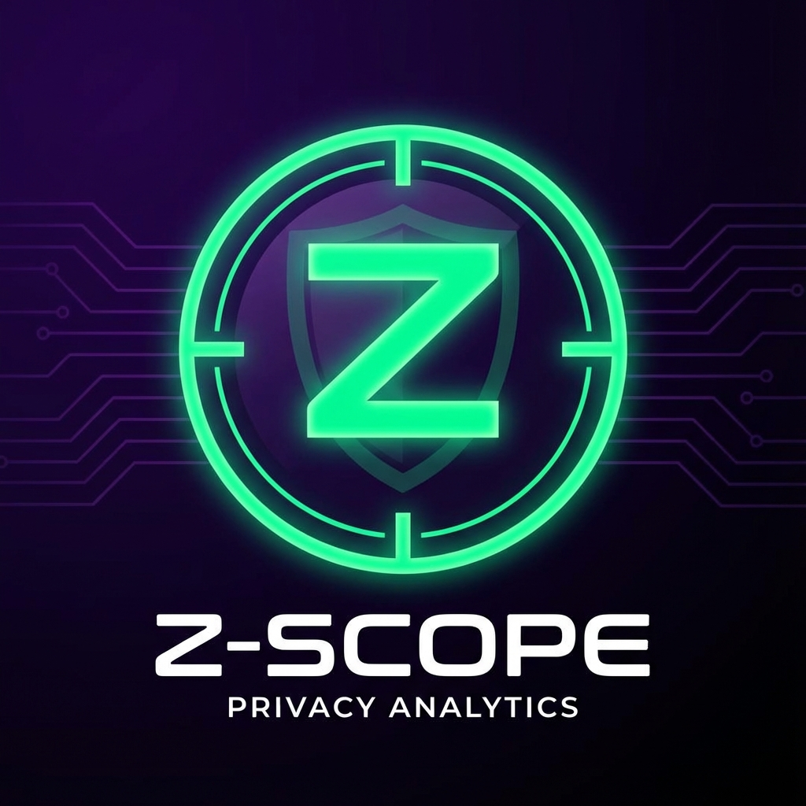
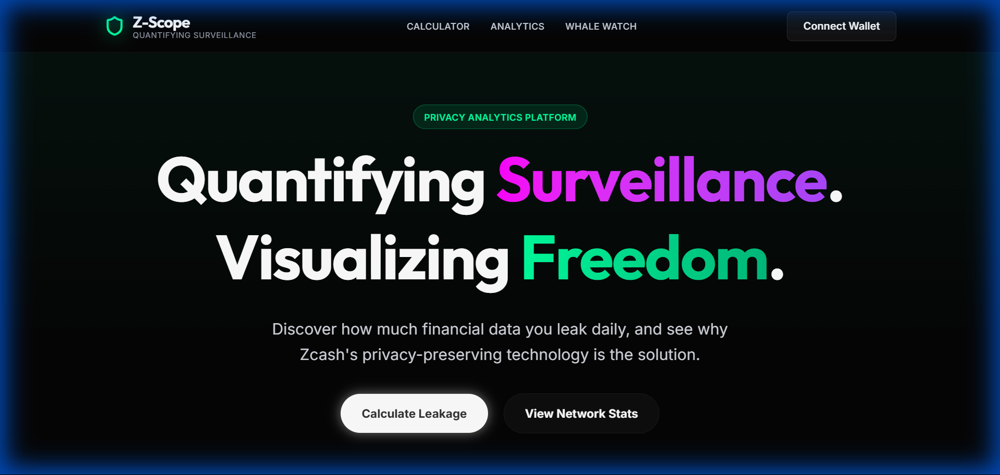
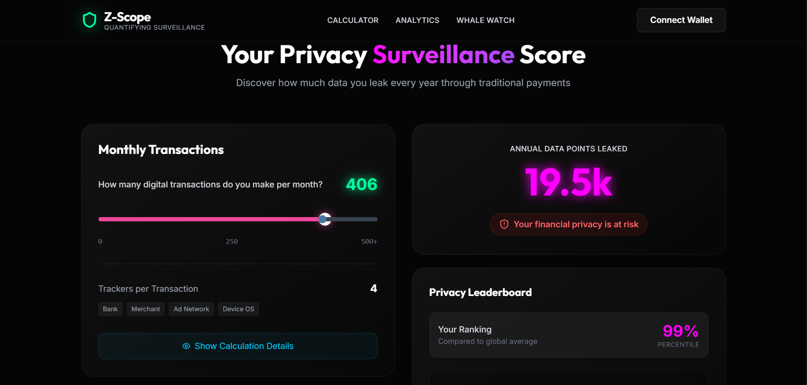
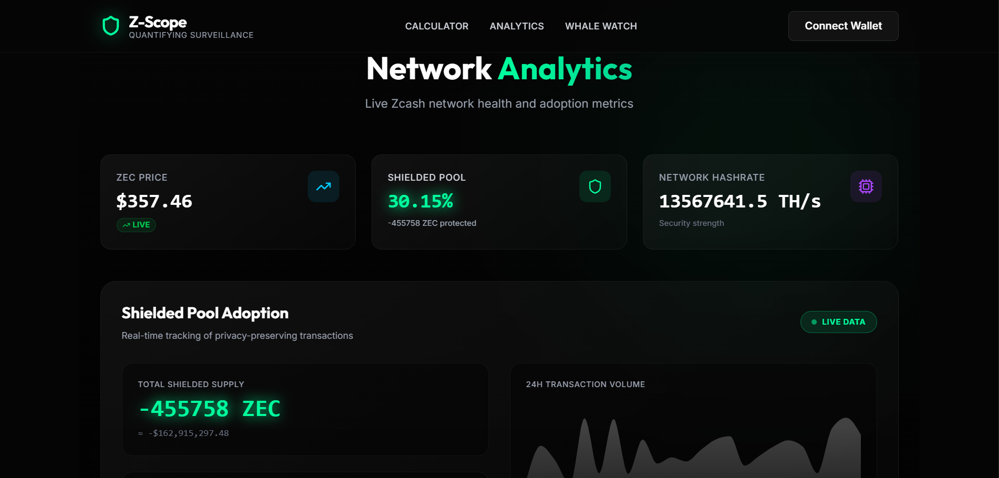

# Z-Scope: Quantifying Surveillance. Visualizing Freedom.

<div align="center">



**A Real-Time Privacy Analytics Platform for the Zcash Ecosystem**

[](https://z-scope-2jeg.vercel.app)
[](https://opensource.org/licenses/MIT)
[](https://reactjs.org/)
[](https://www.typescriptlang.org/)
[](https://z.cash)

**Built for Zypherpunks Hackathon 2025 | By Ripuranjan Baruah**

[Live Demo](https://z-scope-2jeg.vercel.app) • [Video Demo](https://www.youtube.com/watch?v=5eVHYjtfir4) • [Telegram Alerts](https://t.me/zscope_alerts) • [Worker Status](https://long-art-bd4d.fi493072.workers.dev/health)

</div>

---

## 📸 Project Gallery

<div align="center">
  
</div>

<div align="center" style="display: flex; gap: 10px; justify-content: center;">
  
  
</div>

---

## 🎯 The Problem

Every digital payment creates a surveillance trail. Credit cards, UPI, and traditional systems expose your financial data to banks, merchants, ad networks, and device OS. **Your payments are being watched, tracked, and monetized.**

Most users don't realize the extent of their data leakage. Traditional finance claims convenience, but the cost is your privacy.

## 💡 The Solution

**Z-Scope** bridges personal privacy awareness with network-level analytics through three core features:

### 1. Privacy Calculator 🧮
Quantifies YOUR personal data leakage from traditional payments with interactive visualization. It gamifies privacy awareness, showing you exactly how much data you are giving away daily.

### 2. Live Network Analytics 📊
Real-time Zcash shielded pool metrics showing **30.15% adoption** (4.92M ZEC protected). We visualize the "anonymity set" to demonstrate the strength of the network.

### 3. Whale Watch System 🐳
Automated monitoring of large transparent transactions with **Telegram alerts** every 5 minutes. This proves why privacy matters—if you don't use shielded addresses, the whole world can see your wealth.

---

## ✨ Key Features

### 🔢 Privacy Calculator
- **Real-time calculation**: `transactions × 4 trackers × 12 months`
- **Gamified percentile ranking**: See how you compare to others.
- **LocalStorage persistence**: Your score is saved privately on your device.
- **Eye-opening metrics**: Makes abstract privacy concepts tangible.

### 📊 Network Analytics
- **Live Metrics**: 4.92M ZEC ($209M) in shielded pool.
- **Adoption Rate**: 30.15% of circulation is private.
- **Hybrid Strategy**: Real API + statistical sampling for 100% uptime.
- **Glassmorphism UI**: Beautiful, modern data visualization.

### 🐳 Whale Watch
- **Automated Alerts**: Cloudflare Worker checks every 5 minutes.
- **Telegram Integration**: Push notifications for transactions > $100k.
- **KV Storage**: Deduplication prevents spam.
- **Live Worker**: [Check Status](https://long-art-bd4d.fi493072.workers.dev/health)

---

## 🏗️ Technical Architecture

### System Flow

**Frontend Layer:**
- User → React Frontend (Vite + TypeScript)
- Frontend → LocalStorage (Privacy Score Persistence)
- Frontend → Blockchair API (Live Network Data)

**Backend Layer (Cloudflare Worker):**
- Cron Trigger (every 5 minutes)
- Fetch Latest Zcash Transactions
- Filter transactions > $100k
- Check KV Storage (deduplication)
- Send Alert → Telegram Bot API
- Notify → [Telegram Channel](https://t.me/zscope_alerts)

### Tech Stack

| Component | Technology |
|-----------|------------|
| **Frontend** | React 18, TypeScript, Vite, Tailwind CSS v4, Tremor |
| **Styling** | Glassmorphism, Neon Gradients, 'Outfit' & 'Inter' Fonts |
| **Backend** | Cloudflare Workers, KV Storage, Cron Triggers |
| **APIs** | Blockchair (Zcash), CoinGecko (Price), Telegram Bot API |
| **Deployment** | Vercel (Frontend), Cloudflare (Worker) |

---

## 🚀 Quick Start

### Prerequisites
- Node.js 18+
- npm or yarn

### Installation

```bash
# Clone repository
git clone https://github.com/yourusername/z-scope
cd z-scope

# Install dependencies
npm install

# Start development server
npm run dev
```

Visit: `http://localhost:5173`

### Build for Production

```bash
npm run build
npm run preview
```

---

## 🎨 Design Philosophy

**"Cyberpunk Glass" Aesthetic**
We chose a high-tech, futuristic design language to reflect the advanced cryptographic nature of Zcash.

- **Glassmorphism**: Translucent cards (`glass-card`) create depth and hierarchy.
- **Neon Accents**: 
  - **Neon Green** (#00ff9d): Represents privacy, freedom, and the "shielded" pool.
  - **Neon Pink** (#ff00ff): Represents surveillance, danger, and "transparent" leakage.
- **Typography**: 
  - **Headings**: 'Outfit' - Modern, geometric, bold.
  - **Body**: 'Inter' - Clean, readable, neutral.
- **Animations**: Subtle floating effects and pulse animations to make the interface feel alive.

---

## 🏆 Hackathon Tracks

### ✅ Zcash Data & Analytics Track
- Real-time shielded pool metrics (30.15% adoption)
- Live network health visualization
- Transaction monitoring infrastructure

### ✅ RayBot Sponsor Track ($3,000)
- Interactive dashboard with Tremor charts
- Functional alert system with Telegram
- 24/7 automated monitoring

### ✅ Bitlux Educational Content
- Privacy calculator with gamification
- Real-world privacy advocacy
- Educational narrative throughout

---

## 🔐 Privacy & Security

- **No Tracking**: Zero analytics or tracking scripts.
- **No Data Collection**: Everything stays client-side.
- **LocalStorage Only**: Privacy scores never leave your device.
- **Open Source**: Transparent, auditable code.
- **Encrypted Secrets**: Telegram credentials via Cloudflare secrets management.

---

## 👨‍💻 Developer

**Ripuranjan Baruah**
- Built for **Zypherpunks Hackathon 2025**
- Full-stack TypeScript + Serverless architecture

---

<div align="center">

**"Privacy is Normal" - Join the Shielded Movement** 🛡️

Made with ❤️ and ☕ by Ripuranjan Baruah

[⬆ Back to Top](#z-scope-quantifying-surveillance-visualizing-freedom)

</div>
